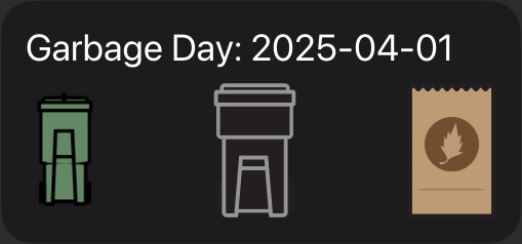

# Toronto Garbage Widget

Display your next garbage day in a widget.

## Configuration

Set `OUR_GROUP` to the name of your trash pickup group. You can find it by following these steps:

1. Go to [the City of Toronto website](https://www.toronto.ca/services-payments/recycling-organics-garbage/houses/collection-schedule) and type in your address;
2. When the schedule pops up, open the PDF in the link labelled `Download your full-year collection schedule (PDF)`;
3. In the top-right corner of the PDF, it will say "Day of Week | Day X" where Day of Week will be one of Tuesday, Wednesday, Thursday, or Friday, and X will be 1 or 2.
4. The value of `OUR_GROUP` is `DayOfWeekX`, e.g., `Tuesday | Day 1` gets written as `Tuesday1`.

